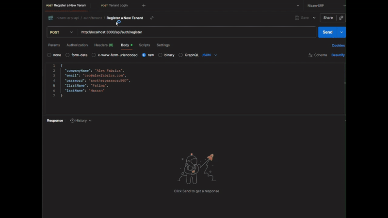

# Nizam ERP (نظام)

<p align="center">
  
</p>

Nizam ERP is a **multi-tenant, modular SaaS (Software as a Service)** platform designed to provide small and medium-sized enterprises (SMEs) with a unified system for managing core business operations.

This project is the v1.0 MVP, demonstrating a scalable and secure architecture. The primary engineering challenge—dynamic, database-per-tenant isolation—is fully implemented.

* **Target Market:** SMEs in the Gulf and Egyptian markets.
* **Core Problem Solved:** Replaces messy, disconnected spreadsheets with a single, reliable, and isolated source of truth for each company's data.

-----

## 🚀 Core Architecture: The "Database-per-Tenant" Model

This project's foundation is a robust **Database-per-Tenant** architecture.

**Analogy:** The application is an apartment building.

* **`nizam_main` (The "Lobby" DB):** A single central database that only knows *who* lives in *which apartment*. It contains the `tenants` and `users` tables.
* **Tenant Databases (The "Private" DBs):** When a new company registers (e.g., "Apex Manufacturing"), the system **dynamically creates a brand-new, completely isolated database** (e.g., `tenant_apex_manufacturing`).
* **The Flow:**
  1. A user logs in via the central `nizam_main` DB.
  2. They receive a JWT containing their unique `tenantId`.
  3. For all subsequent requests (e.g., `GET /api/employees`), the backend reads the `tenantId` from the JWT and **dynamically creates a new connection** to that tenant's private database.

This model provides maximum security and data isolation, as no tenant's data ever co-exists with another's.

-----

## 🛠️ Tech Stack

| Component | Technology | Rationale |
| :--- | :--- | :--- |
| **Workspace** | **Nx (Nrwl Extensions)** | A professional monorepo for managing a large-scale project and sharing code. |
| **Framework** | **NestJS** | A robust, scalable, and modular Node.js framework. |
| **Database** | **Docker (PostgreSQL 15)** | Runs a consistent, isolated, and production-ready database environment locally. |
| **ORM** | **TypeORM** | Defines database tables as TypeScript classes (Entities). |
| **Architecture** | **Multi-Tenancy** | The core database-per-tenant design pattern. |
| **Authentication** | **JWT & Passport.js** | Secure, token-based authentication with a `tenantId` payload. |
| **Validation** | **`class-validator`** | Handles all API request DTO (Data Transfer Object) validation. |
| **Configuration** | **`@nestjs/config` (.env)** | Securely manages all environment variables (e.g., DB passwords, JWT secret). |

-----

## ✨ MVP v1.0 Features (Complete)

This v1.0 is a complete, testable application that fully demonstrates the core architecture.

### ✅ Epic 1: Onboarding & Core Auth

* **Multi-Tenant Registration (`POST /api/auth/register`):**
  * Registers a new company (`Tenant`) in the `nizam_main` DB.
  * Registers the company's first `User` in the `nizam_main` DB.
  * **Dynamically creates a new, private database** for that tenant.
* **Authentication (`POST /api/auth/login`):**
  * Validates credentials against the `nizam_main` DB.
  * Returns a signed **JWT** containing the `userId` and `tenantId`.
* **Protected Routes (`AuthGuard`):**
  * Includes a `GET /api/auth/profile` endpoint protected by the JWT guard.

### ✅ Epic 2: Basic HRM Module (Tenant-Isolated)

* **Fully Protected:** All endpoints are locked and require a valid JWT.
* **Dynamic Connections:** The `EmployeeService` is **Request-Scoped**, creating a new, dynamic connection to the correct tenant's private database *on every request*.
* **Automatic Table Creation:** The `synchronize: true` flag in the dynamic connection automatically creates the `employees` table in the new tenant database on first access.
  * **Full CRUD Operations:**
    * `POST /api/employees` - Create a new employee.
    * `GET /api/employees` - Get a list of all employees *for that tenant only*.
    * `GET /api/employees/:id` - Get a single employee.
    * `PATCH /api/employees/:id` - Update an employee.
    * `DELETE /api/employees/:id` - Delete an employee.

-----

## 🗺️ Future Roadmap

* **`feature/inventory-module` (In Progress):** Work is beginning on the next module in a separate branch.
* **Epic 4: Basic Production Planning Module**
* **Database Migrations:** Move from `synchronize: true` to a production-ready TypeORM migration system that can provision new tenant databases.

-----

## ⚙️ How to Run This Project

1. **Ensure Docker Desktop is running.**
1. Start the PostgreSQL database:

```bash
docker-compose up -d
```

1. Install dependencies:

```bash
npm install
```

1. Copy `.env.example` to `.env` and fill in the variables (if you have an example file).
1. Run the application:

```bash
npx nx serve nizam-erp
```

* **App URL:** `http://localhost:3000`
* **Database (pgAdmin):** Connect to `localhost:5432` with the credentials from your `.env` file.

-----

## 🧪 How to Test (Postman)

A Postman collection is included in this repository to test all endpoints and the data isolation.

1. Import the `assets/postman/nizam-erp.collection.json` file into Postman.
1. Create a new Postman Environment and add a variable:

* **Variable:** `accessToken`
* **Value:** (leave blank)

1. Run the requests in order. The "Login" request includes a test script to automatically save your JWT to the `accessToken` variable, which all protected requests use.

-----

## Contact

If you'd like to reach out, contact:

* LinkedIn: [Ahmed M. Naeim](https://www.linkedin.com/in/ahmed-m-naeim/)
* GitHub: [Ahmed-Naeim](https://github.com/Ahmed-Naeim)
* Email: [eng.a.naeim@gmail.com](mailto:eng.a.naeim@gmail.com)

---

## Production & Deployment

A full, reproducible production deployment runbook is maintained in the repository. Follow it for building, running migrations, and deploying the app in a controlled way:

- See: `PRODUCTION_RUNBOOK.md` — contains recommended CI flows, migration runner guidance, Docker/compose instructions, and rollback notes.

If you're preparing a release, run migrations from CI or a controlled job before deploying application instances. The runbook includes suggested commands and safety checks.
